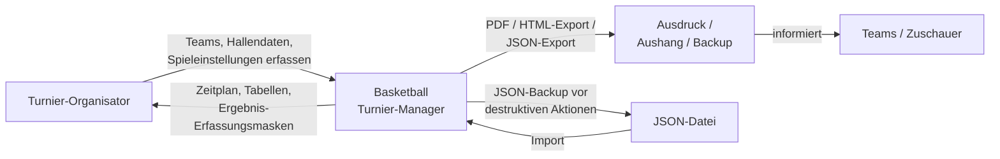
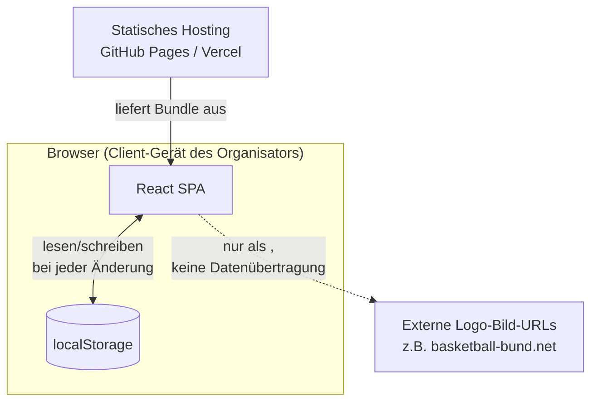

# 3. Kontextabgrenzung

## 3.1 Fachlicher Kontext

Die App hat genau eine menschliche Nutzerrolle mit aktiver Interaktion: den **Turnier-Organisator**.
Alle anderen Beteiligten (Teams, Zuschauer) konsumieren nur Ausgaben (Ausdrucke, exportierte
Webseite), ohne selbst mit der Anwendung zu interagieren.

**Eingaben des Organisators:**
- Teamdaten (Name, Kürzel, Logo-URL, Farbe, Kontakt, Spielerkader).
- Turniermodus und -parameter (Feldanzahl, Gruppenanzahl, Endrunden-Variante, Schweizer-Runden, ...).
- Halleninformationen (Öffnungszeiten, Sperrzeiten, Auf-/Abbauzeit).
- Spieleinstellungen (Anzahl/Dauer der Abschnitte, Pausenregeln).
- Spielergebnisse (laufend, mit Korrekturmöglichkeit).
- Teamrückzüge während des laufenden Turniers.

**Ausgaben an den Organisator/Dritte:**
- Automatisch generierter Zeitplan (Feld, Uhrzeit, beteiligte Teams je Spiel).
- Gruppentabellen, Schweizer-System-Tabelle, Endstand.
- PDF-Export, HTML/ZIP-Export (druckfertige statische Webseite), JSON-Export (Vollsicherung).

## 3.2 Technischer Kontext

Es gibt **keine** Server-Kommunikation zur Laufzeit außer dem einmaligen Laden des statischen
Bundles beim Seitenaufruf. Die einzige externe Ressource, die die App referenziert, sind optionale
Team-Logo-Bild-URLs (z. B. von `basketball-bund.net`, siehe Demo-Datensätze unter `public/demos/`)
— diese werden ausschließlich als `` geladen, es findet kein API-Aufruf, kein
Datenaustausch mit diesen Domains statt.

Die JSON-Export-/Import-Funktion (`src/lib/export/json-export.ts`, `src/lib/import/json-import.ts`)
ist der einzige Weg, Turnierdaten zwischen zwei Geräten/Browsern zu übertragen — der Nutzer muss die
Datei selbst kopieren (USB-Stick, Cloud-Speicher, E-Mail); die App selbst transportiert nichts.

## 3.3 Abgrenzung zu einem möglichen Server-Backend

Ursprünglich war eine "Phase 2" mit Server-Backend (Go, Raspberry Pi, Live-Daten am Spieltag)
angedacht (`docs/superpowers/specs/2026-06-23-planer-phase1-design.md`), aber nie begonnen. Die
aktuelle App ist vollständig als reiner Client konzipiert und für diesen Zweck bewusst
selbstgenügsam gehalten (JSON-Export als "Schnittstelle" zu einem möglichen künftigen Backend, ohne
dass ein solches existiert).
