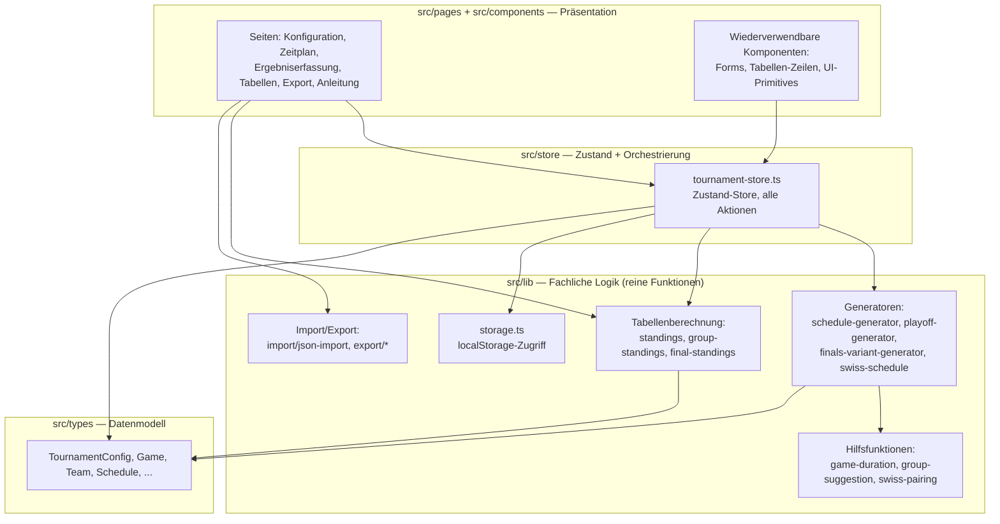

# 5. Bausteinsicht

## 5.1 Ebene 1 — Grobstruktur

**Faustregel für "wo muss ich ändern":**

| Ich will ändern ... | ... dann in dieser Datei/diesem Ordner |
|---|---|
| Wie Spiele zeitlich/auf Felder verteilt werden | `src/lib/schedule-generator.ts`, `game-duration.ts` |
| Wie ein KO-Baum (Halbfinale/Viertelfinale/...) aufgebaut wird | `src/lib/finals-variant-generator.ts` (`buildBracket`), `playoff-generator.ts` (Legacy-4er-Fall) |
| Wie Teams nach Ergebnissen automatisch in Folgespiele eingesetzt werden | `resolvePlaceholders` in `src/store/tournament-store.ts` |
| Tabellenberechnung (Punkte, Sortierung) | `src/lib/standings.ts` (Swiss), `group-standings.ts` (Gruppenphase), `final-standings.ts` (Endstand) |
| Eine neue Konfigurationsoption in der UI | `src/components/config/*.tsx` + zugehörige Store-Aktion in `tournament-store.ts` + `TournamentConfig`-Typ in `src/types/index.ts` |
| Eine neue Seite/Route | `src/pages/*.tsx` + Eintrag in `src/App.tsx` + Nav-Eintrag in `src/components/layout/AppShell.tsx` |
| Export-Format | `src/lib/export/*.ts` |
| Das gemeinsame PDF-Farbschema/Layout | `src/lib/export/pdf-theme.ts` (siehe Kapitel 5.7) |
| Anleitungs-Inhalt (Text, Screenshots, Hinweisboxen) | `src/content/manual.md` (siehe Kapitel 5.7, ADR-10) — NICHT `ManualPage.tsx` direkt |
| Was in `localStorage` landet | `src/lib/storage.ts` |

## 5.2 Ebene 2 — Die Generatoren im Detail (Blackbox-Sicht)

Dies ist der fachlich komplexeste und am häufigsten fehleranfällige Teil der Anwendung (siehe
Kapitel 11). Jede Blackbox wird über Eingabe, Ausgabe und Invarianten beschrieben.

### `schedule-generator.ts` — Einstiegspunkt und Orchestrator

- **Eingabe**: vollständiges `TournamentConfig`.
- **Ausgabe**: vollständiges `Schedule` (alle `Game`-Objekte, inkl. noch unaufgelöster
  Endrunden-Platzhalter).
- **Verhalten**: verzweigt nach `config.mode` (`swiss` → `swiss-schedule.ts`;
  `round-robin`/`round-robin+finals` → eigene Gruppenphasen-Logik via `generateRoundRobinRounds`,
  dann je nach `finalsVariant` einer von vier Zweigen: `endrunde-4` → `buildPlacementCohorts`/
  `buildPlacementGames`; `endrunde-1` → `buildBracket` einmal je Rangstufe; `endrunde-3` →
  `generatePlayoffGames` mit `qualifierSourceRanks`; kein `finalsVariant` → generischer
  `generatePlayoffGames`-Fallback ohne Gruppenbezug).
- **Wichtige Invariante**: `fieldNextFree` (Array, ein Eintrag je Feld) wird über alle Phasen
  hinweg fortgeschrieben — jede nachfolgende Phase (Endrunde) darf ein Feld erst nutzen, sobald die
  Gruppenphase es dort tatsächlich freigegeben hat. `buildBracket`/`buildPlacementGames` nehmen
  dazu eine interne KOPIE von `fieldNextFree` entgegen und schreiben nicht zurück — der Aufrufer
  (`schedule-generator.ts`) muss den tatsächlichen Feld-Endzustand nach jedem Rangstufen-Durchlauf
  selbst zurückrechnen (siehe Kommentar in `schedule-generator.ts` Zeilen 213–226).
- **Wirft** (statt leeren Zeitplan zurückzugeben), wenn die Hallenzeit für eine Phase nicht reicht
  — siehe Kapitel 6 für die Fehlerbehandlung im Store.

### `generateRoundRobinRounds` (in `schedule-generator.ts`) — Rundenbewusste Paarungserzeugung

- **Eingabe**: Liste von Team-IDs.
- **Ausgabe**: Liste von Runden, jede Runde eine Liste von `[heim, auswärts]`-Paaren.
- **Algorithmus**: Circle-Method/Berger-Tabelle — garantiert, dass innerhalb einer Runde jedes Team
  höchstens einmal spielt, wodurch alle Paarungen einer Runde parallel auf verschiedene Felder
  verteilt werden können. Bei ungerader Teamzahl bekommt ein Team pro Runde ein echtes Aussetzen
  (kein `Game`, kein Freilos-Bonus — Unterscheidung zum Schweizer System, siehe Kapitel 8/12).

### `playoff-generator.ts` — Der ursprüngliche, feste 2er/4er-KO-Baum

- **Eingabe**: `finalsBracketSize: 2 | 4`, Zeitrahmen-Parameter, optional `qualifierSourceRanks`
  (nur bei Endrunde 3).
- **Ausgabe**: `Game[]` für Halbfinale (falls 4), Spiel um Platz 3 (falls 4) und Finale.
- **Bekannte Einschränkung**: dupliziert einen Teil der Logik, die `finals-variant-generator.ts`s
  `buildBracket` generisch für beliebige Zweierpotenzen bereits kann — im Code selbst als
  Cleanup-Kandidat markiert (siehe Kapitel 9/11).

### `finals-variant-generator.ts` — Die generalisierte KO-Baum- und Platzierungslogik

- **`buildBracket(input)`**: baut rekursiv einen kompletten KO-Baum für `bracketSize ∈ {2,4,8,16,32}`
  — jede Runde erzeugt `bracketSize / 2^runde` Spiele, referenziert die Vorrunde über
  `homeSourceMatch`/`awaySourceMatch: {stage, matchIndex, outcome}`. Nur die erste Runde referenziert
  stattdessen `homeSourceRank`/`awaySourceRank` (Gruppenphase-Rang). Erzeugt zusätzlich immer ein
  Spiel um Platz 3, sofern es ein Halbfinale gibt (ab `bracketSize ≥ 4`).
- **`buildQualifierSeeds(groupIds, rank)`**: erzeugt die Start-Setzliste für einen KO-Baum nach
  Standard-Turnierseeding (Setzlisten-Platz 1 trifft den schwächsten verbleibenden Platz), rein
  alphabetisch nach `groupId` — es gibt **kein** stärkebasiertes Seeding zwischen Gruppen (siehe
  Kapitel 8, `computeGroupPhaseBuchholz` ist bewusst ungenutzt für einen späteren Ausbau).
- **`buildPlacementCohorts` / `buildPlacementGames`**: für Endrunde 4 — teilt Gruppenstandings in
  Rangstufen-Kohorten (Rang 1 aller Gruppen, Rang 2 aller Gruppen, ...) und erzeugt für jede Kohorte
  eine eigene Round-Robin-Runde (kein KO-Baum, kein Spiel um Platz 3 nötig — die Kohorten-Tabelle
  selbst ergibt die Platzierung).
- **`computeGroupPhaseBuchholz`**: vorhanden, aber aktuell von keinem Aufrufer genutzt — bewusst für
  eine spätere Nachrücker-/Wildcard-Erweiterung vorgehalten (siehe Kapitel 11).

### `swiss-schedule.ts` + `swiss-pairing.ts` — Schweizer System

- **`generateSwissSchedule`**: erzeugt Runde 1 sofort vollständig (zufällig gepaart,
  `pairFirstSwissRound`), alle Folgerunden nur als leere Platzhalter-Slots (Teams stehen erst nach
  Auswertung der Vorrunde fest — anders als bei der Gruppenphase/Endrunde wird hier NICHT der
  gesamte Baum im Voraus mit Zeigern generiert, sondern rundenweise real nachbestückt über
  `applySwissPairing`/`advanceSwissRound` im Store).
- **`pairNextSwissRound`**: Backtracking-Algorithmus, der Teams nach aktueller Tabelle paart, ohne
  eine bereits gespielte Paarung zu wiederholen; wirft `PairingConflictError`, wenn keine gültige
  Paarung mehr existiert (UI bietet dann eine manuelle Paarungs-Eingabe an, siehe
  `SwissResultsPage.tsx`).

## 5.3 Ebene 2 — Standings/Tabellen

- **`standings.ts`**: Schweizer-System-Tabelle (`computeStandings`), inkl. Buchholz-Zahl, sortiert
  nach Punkte → Buchholz → Korbdifferenz.
- **`group-standings.ts`**: Gruppenphasen-Tabelle (`computeGroupStandings`), sortiert nach Punkte →
  direkter Vergleich (nur unter punktgleichen Teams) → Korbdifferenz. Bewusst KEIN Buchholz-Feld
  (andere Datengrundlage/Sortierlogik als das Schweizer System, siehe `2026-09-12-
  multi-group-round-robin-design.md`).
- **`final-standings.ts`**: kombiniert die Ergebnisse mehrstufiger Formate zu einer durchgehenden
  1..N-Rangliste — `computeFinalStandings` für Endrunde 4 (Kohorten-Tabellen), `computeEndrunde1Standings`
  für Endrunde 1 (KO-Baum-Ergebnisse, siehe Kapitel 11 für eine bekannte Einschränkung).

## 5.4 Ebene 2 — Store (`tournament-store.ts`)

Der Store ist mehr als ein reiner Datencontainer — er enthält die zentrale Orchestrierungslogik:

- **`resolvePlaceholders(games, teams)`**: läuft nach jedem `submitGameResult`/`correctGameResult`/
  `withdrawNonSwissTeam`-Aufruf erneut über ALLE Spiele und ersetzt Platzhalter durch echte Teams,
  sobald ihre Quelle (Gruppenrang oder Vorgängerspiel) feststeht. Siehe Kapitel 6 für den Ablauf.
- **`withdrawSwissTeam` vs. `withdrawNonSwissTeam`**: strukturell unterschiedliche Rückzugslogik,
  weil beim Schweizer System künftige Runden erst zur Laufzeit real generiert werden (müssen
  "umgeformt" werden — `reshapeFutureSwissRounds`), während bei Gruppenphase/Endrunde der gesamte
  Zeitplan bereits feststeht (nur Annullierung als Walkover, keine Neuplanung nötig).
- **`generateAndSaveSchedule`**: fängt eine von `generateSchedule` geworfene Exception ab und setzt
  `scheduleGenerationError`, statt den zuletzt funktionierenden Zeitplan zu verwerfen (siehe Kapitel 6).

## 5.5 Ebene 2 — Seiten (`src/pages/`)

| Seite | Route | Zweck |
|---|---|---|
| `ManualPage` | `/`, `/anleitung` | Eingebautes Handbuch; ist bewusst die Startseite |
| `TeamsPage` | `/teams` | Teamverwaltung |
| `ConfigPage` | `/config` | Zentrale Konfiguration (Modus, Felder, Gruppen, Endrunden-Variante, Halle, Zeitplan-Generierung, Import/Export/Reset) |
| `SchedulePage` | `/schedule` | Read-only Gesamtzeitplan (nicht bei Swiss/Gruppenphase mit eigener Ergebnisseite) |
| `SwissResultsPage` / `SwissOverviewPage` | `/swiss-results`, `/swiss-overview` | Ergebniserfassung bzw. Turnierübersicht im Schweizer System |
| `GroupResultsPage` / `GroupOverviewPage` | `/group-results`, `/group-overview` | Ergebniserfassung bzw. Tabellen der Gruppenphase |
| `FinalsResultsPage` | `/finals-results` | Ergebniserfassung für Endrunde 4 (Platzierungsgruppen) |
| `PlayoffResultsPage` | `/playoff-results` | Ergebniserfassung für Endrunde 3 (einzelner KO-Baum) |
| `BracketResultsPage` | `/bracket-results` | Tab-basierte Ergebniserfassung für Endrunde 1 (mehrere KO-Bäume, ein Tab je Rangstufe) |
| `FinalStandingsPage` | `/final-standings` | Kombinierter Endstand (Endrunde 1 und 4) |
| `ExportPage` | `/export` | PDF/HTML/JSON-Export |

Die Sichtbarkeit der jeweiligen Nav-Einträge wird zentral in `AppShell.tsx` anhand von
`tournament.mode`/`tournament.finalsVariant`/Gruppenanzahl gesteuert (siehe Kapitel 8).

## 5.6 Ebene 2 — Komponenten (`src/components/`)

| Ordner | Inhalt |
|---|---|
| `config/` | Alle Konfigurationsformulare (`TournamentForm`, `GroupAssignmentForm`, `FinalsVariantForm`, `GameSettingsForm`, `LockedSectionGate`) |
| `venue/` | Hallenformular, Sperrzeiten-Liste |
| `teams/` | Teamliste, -karte, -formular, Namensanzeige (inkl. Logo) |
| `schedule/` | Zeitplan-Ansicht, einzelne Spielzeile (`GameRow`), Konflikt-Badge |
| `export/` | Export-Bedienfeld |
| `layout/` | `AppShell` (Kopfzeile, Navigation, Routing-Outlet) |
| `ui/` | Generische, Radix-basierte Primitives (Button, Select, Dialog, Alert, Input, Label) |

## 5.7 Ebene 2 — PDF-Export (`src/lib/export/*-pdf.ts`)

Alle vier PDF-Downloads (Zeitplan, Gruppentabellen, Schweizer-System-Übersicht, Anleitung) sind
native `@react-pdf/renderer`-Dokumente (kein `window.print()`-Umweg mehr, siehe ADR-10) und teilen
sich ein gemeinsames visuelles Thema:

- **`pdf-theme.ts`**: einzige Quelle für Farben (`pdfColors`) und Basis-`StyleSheet`s
  (`pdfBaseStyles`) — blaue Überschriften/Tabellenköpfe, Zebra-Zeilen. Alle vier Exporte
  importieren von hier, keiner definiert eigene Farbwerte.
- **`pdf-round-table.ts`**: die Rundenspielplan-Tabelle (Feld/Zeit-oder-Ergebnis/Paarung), von
  `group-overview-pdf.ts` und `swiss-overview-pdf.ts` gemeinsam genutzt (identische Anforderung in
  beiden Kontexten, daher ein Modul statt zweier Kopien).
- **`group-overview-pdf.ts`** / **`swiss-overview-pdf.ts`**: je ein `build*Document(...)` (baut den
  react-pdf-Elementbaum, direkt testbar ohne echten Download auszulösen) plus ein
  `download*Pdf(...)` (löst `pdf(doc).toBlob()` + Download aus) — dieses Muster (getrennte
  Build- und Download-Funktion) gilt für alle vier Exporte, auch den ursprünglichen
  Zeitplan-Export (`pdf-export.ts`s `buildSchedulePdfDocument`/`downloadPdf`).
- **`manual-pdf.ts`**: lädt `src/content/manual.md`, holt referenzierte Screenshots als
  Data-URIs (`fetchImagesAsDataUris`), rendert über `manual-markdown-pdf.ts` und triggert den
  Download. Abschnitte werden NICHT als unteilbare (`wrap: false`) Blöcke behandelt — ein Fix
  während der finalen Review dieses Features stellte fest, dass react-pdf einen zu großen
  `wrap: false`-Block (ein Anleitungsabschnitt mit vielen Screenshots ist oft länger als eine
  Seite) still überlaufen lässt statt ihn umzubrechen, was Inhalte aus dem PDF verschwinden
  ließ.

**Anleitung: Markdown statt JSX (siehe ADR-10).** `manual-markdown-jsx.tsx` (Web) und
`manual-markdown-pdf.ts` (PDF) rendern denselben, über `markdown-tokens.ts`
(`tokenizeManualMarkdown`, Wrapper um `marked`) tokenisierten Inhalt aus `src/content/manual.md`
auf zwei unterschiedliche Ziel-Primitive (HTML/Tailwind bzw. react-pdf `Text`/`View`/`Image`).
`marked` hat kein natives Konzept für Hinweisboxen — dafür gibt es eine eigene
`::: callout Titel\n...\n:::`-Konvention, die `markdown-tokens.ts` vor dem eigentlichen
`marked.lexer()`-Aufruf aus dem Text herausschneidet und als eigenen `callout`-Token wieder
einfügt. Bekannte Eigenheit von `marked`: eine alleinstehende ``-Zeile wird als
`paragraph`-Token mit einem verschachtelten `image`-Token tokenisiert, nie als eigenständiger
`image`-Token — beide Renderer (und `manual-pdf.ts`s Bild-Sammlung) behandeln diesen Fall
explizit.
