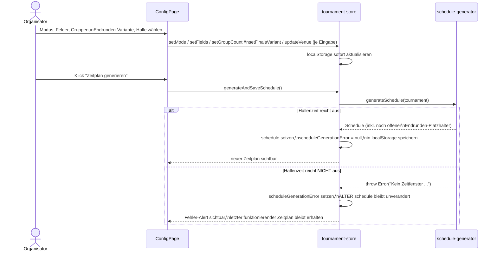
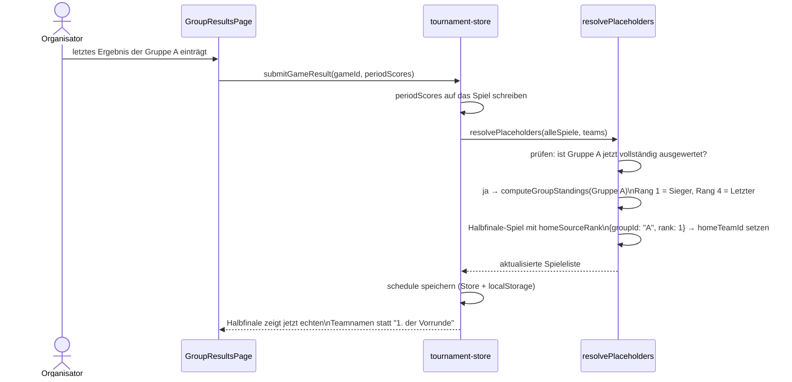
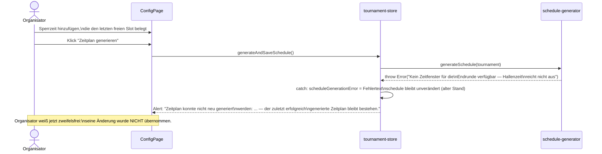

# 6. Laufzeitsicht

## 6.1 Szenario: Turnier konfigurieren → Zeitplan generieren

Wichtig: Bei mehreren Gruppen (`groupCount > 1`) blockiert `ConfigPage` den Button bereits VORHER,
wenn keine `finalsVariant` gewählt ist (`needsFinalsVariant`-Prüfung) — das verhindert, dass
überhaupt ein Zeitplan mit nie auflösbaren Endrunden-Platzhaltern entstehen kann (siehe Kapitel 8).

## 6.2 Szenario: Ergebnis eintragen → automatische Platzhalter-Auflösung

Beispiel Endrunde 3 (ein KO-Baum: Halbfinale → Finale/Platz-3), analog für Endrunde 1 (mehrere
parallele Bäume) und Endrunde 4 (Platzierungsgruppen als Kohorten statt Baum-Zeiger).

Bei einer **Korrektur** eines bereits erfassten Ergebnisses (`correctGameResult`) läuft exakt
derselbe `resolvePlaceholders`-Durchlauf erneut — ein Folgespiel wird dabei nur überschrieben, wenn
es selbst noch KEIN eigenes Ergebnis hat (`g.periodScores.length > 0` blockiert die Neubefüllung).
Ein bereits gespieltes Halbfinale wird also nie rückwirkend durch eine spätere
Gruppenphase-Korrektur "repariert" — das ist eine bewusste Grenze, kein Bug (siehe Kapitel 8).

## 6.3 Szenario: Fehlgeschlagene Zeitplan-Regenerierung (Bugfix-Beispiel)

Dieses Szenario dokumentiert einen tatsächlich aufgetretenen und behobenen Fehler, weil er die
Bedeutung von "Fehler sichtbar machen statt schweigend verwerfen" als Architekturprinzip greifbar
macht (siehe Qualitätsziel 6 in Kapitel 1).

**Vorher (Fehlerbild):** Ein Organisator fügt nachträglich eine Mittagspause (Sperrzeit) hinzu und
klickt erneut auf "Zeitplan generieren". Die Hallenzeit reicht dadurch nicht mehr für die
Endrunde. `generateSchedule` wirft eine Exception. Diese wurde nirgends abgefangen — der
`set({ schedule })`-Aufruf im Store wurde nie erreicht. Ergebnis: Der Organisator sieht weiterhin
den ALTEN Zeitplan (ohne die neue Sperrzeit berücksichtigt) und hält ihn fälschlich für aktuell und
korrekt.

**Nachher (Fix):**

Diese Verhaltensänderung liegt in `generateAndSaveSchedule` (`tournament-store.ts`): ein
`try/catch` um den `generateSchedule`-Aufruf, das bei Fehlschlag `scheduleGenerationError` statt
`schedule` setzt. `ConfigPage.tsx` zeigt diesen Zustand als eigenen `Alert` unterhalb des
"Zeitplan generieren"-Buttons an.
