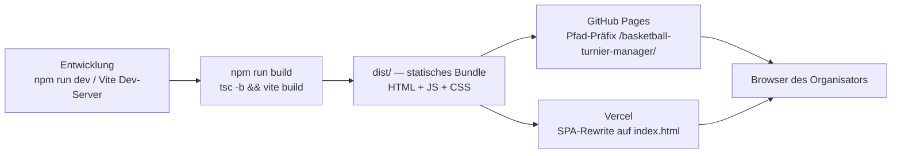

# 7. Verteilungssicht

Die Verteilungssicht ist bewusst schlank, da es keine klassische Mehrknoten-Server-Architektur
gibt — die gesamte Anwendung ist ein einzelnes statisches Bundle, das im Browser des Organisators
läuft.

## 7.1 Build- und Auslieferungspipeline

- **GitHub Pages** (`.github/workflows/deploy-pages.yml`): läuft automatisch nach jedem
  erfolgreichen CI-Lauf auf `main` (`workflow_run`-Trigger), baut mit `GITHUB_PAGES=true`
  (Vite `base` wird dann auf `/basketball-turnier-manager/` gesetzt, siehe `vite.config.ts`) und
  deployt via `actions/deploy-pages@v4`.
- **Vercel** (`vercel.json`): reine SPA-Rewrite-Konfiguration (`/(.*)`→`/index.html`), sodass
  Client-seitiges Routing (React Router) auch bei direktem Aufruf einer Unterseite funktioniert.
  Nicht verifiziert, ob ein aktives Vercel-Projekt an dieses Repository angebunden ist — die
  Konfigurationsdatei liegt bereit, das allein belegt keinen aktiven Deploy.

Beide Hosting-Wege liefern exakt dasselbe Bundle aus; es gibt keine serverseitige Logik, keine
Umgebungsvariablen zur Laufzeit außer der Build-Zeit-Unterscheidung des `base`-Pfads.

## 7.2 CI-Pipeline (`.github/workflows/ci.yml`)

Fünf unabhängige, parallel laufende Jobs bei jedem Pull Request und jedem Push auf `main`:

| Job | Zweck | Befehl |
|---|---|---|
| `unit-tests` | Vitest-Unit-/Komponententests | `npm test -- --run` |
| `coverage` | Branch-Coverage-Gate (80 %, pro Datei, nur `src/lib/**` + `src/store/**`) | `npm run test:coverage` |
| `typecheck` | TypeScript-Strict-Prüfung ohne Emit | `npm run typecheck` |
| `build` | Verifiziert, dass ein Produktions-Build gelingt | `npm run build` |
| `e2e-tests` | Vollständige Playwright-Suite (Chromium) gegen den lokalen Dev-Server | `npm run test:e2e` |

Drei Jobs laden ihren Report immer (nicht nur bei Fehlschlag) als CI-Artefakt hoch, damit er auch
nach einem grünen Lauf einsehbar bleibt (14 Tage Aufbewahrung):

- `unit-tests` → `unit-test-report` (Vitest-JUnit-XML, `test-results/junit.xml`).
- `coverage` → `coverage-report` (durchklickbarer HTML-Coverage-Report, `coverage/index.html`).
- `e2e-tests` → `playwright-report` (Playwright-HTML-Report, inkl. Screenshots/Traces
  fehlgeschlagener Läufe, falls vorhanden).

**Nicht im Repository als YAML verifiziert, aber laut Projektkontext aktiv:** GitHub CodeQL
(Standard-Sicherheitsscan) — vermutlich über GitHubs Default-Setup aktiviert, nicht über eine
eigene Workflow-Datei in `.github/workflows/`.

## 7.3 Laufzeitumgebung beim Nutzer

- Läuft in jedem modernen Chromium-/Firefox-/Safari-Browser (kein spezielles Betriebssystem
  vorausgesetzt).
- Persistenz ausschließlich im `localStorage` DIESES Browsers auf DIESEM Gerät — ein Wechsel des
  Browsers, Geräts oder ein Löschen der Browserdaten verliert den Turnierstand vollständig, sofern
  vorher kein JSON-Export erfolgt ist.
- Kein Hintergrundprozess, kein Service Worker, keine Offline-Cache-Strategie über den normalen
  Browser-Cache des statischen Bundles hinaus verifiziert.
