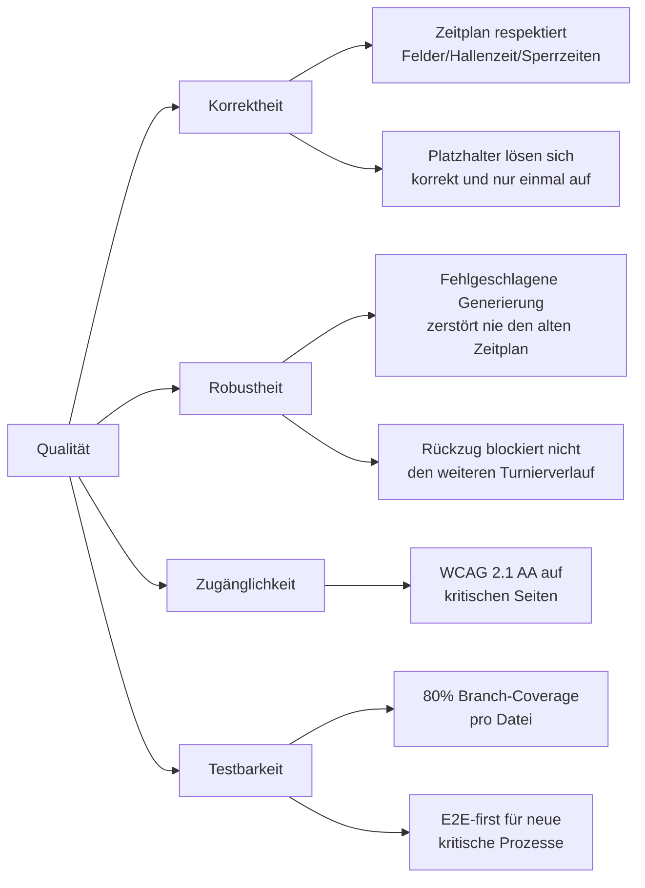

# 10. Qualitätsanforderungen

Konkretisiert die Qualitätsziele aus Kapitel 1 als prüfbare Szenarien (Quelle/Stimulus/Artefakt/
Umgebung/Antwort/Antwortmaß), abgeleitet aus dem, was die vorhandene Test-Suite tatsächlich prüft
— keine erfundenen Wunschziele ohne Testabsicherung.

## 10.1 Qualitätsbaum (Kurzform)

## 10.2 Szenarien

### QS-1: Zeitplan-Generierung unter Kapazitätsdruck (Qualitätsziel 2)

- **Quelle**: Turnier-Organisator
- **Stimulus**: Konfiguriert ein Turnier mit vielen Gruppen/Teams, wenigen Feldern und/oder engen
  Sperrzeiten, klickt "Zeitplan generieren".
- **Artefakt**: `generateSchedule` (`schedule-generator.ts`) und seine Untergeneratoren
  (`playoff-generator.ts`, `finals-variant-generator.ts`, `swiss-schedule.ts`).
- **Umgebung**: Normalbetrieb, beliebige Feld-/Team-/Gruppenkonfiguration innerhalb der
  UI-erlaubten Werte.
- **Antwort**: Entweder wird ein vollständiger, in sich widerspruchsfreier Zeitplan erzeugt (kein
  Spiel außerhalb der Öffnungszeit, kein Spiel in einer Sperrzeit, keine Doppelbelegung von Feld
  oder Team), oder die Generierung schlägt mit einer für den Organisator sichtbaren
  Fehlermeldung fehl (`scheduleGenerationError`) — niemals ein stillschweigend unvollständiger
  oder falscher Zeitplan.
- **Antwortmaß**: 100 % der Generator-Testfälle (`schedule-generator.test.ts`,
  `playoff-generator.test.ts`, `finals-variant-generator.test.ts`, `swiss-schedule.test.ts`)
  bestehen; `e2e/config-validation.spec.ts` bestätigt das Verhalten zusätzlich im echten Browser.

### QS-2: Automatische Platzhalter-Auflösung nach Ergebniseingabe (Qualitätsziel 3)

- **Quelle**: Turnier-Organisator
- **Stimulus**: Trägt das letzte fehlende Ergebnis einer Gruppe/eines Vorgängerspiels ein.
- **Artefakt**: `resolvePlaceholders` (`tournament-store.ts`).
- **Umgebung**: Beliebige Endrunden-Variante (1/3/4), beliebiger Fortschrittsstand.
- **Antwort**: Jedes Folgespiel, dessen Quelle jetzt vollständig feststeht, bekommt sofort die
  richtige(n) Team-ID(s) eingetragen — ohne manuelles Zutun. Ein bereits gespieltes Folgespiel wird
  dabei nie überschrieben.
- **Antwortmaß**: `tournament-store.test.ts`s `resolvePlaceholders`-Testblock (Gruppen-Auflösung,
  Match-Auflösung, Korrektur-Fall, Rückzugs-Fall) grün; `e2e/endrunde-1.spec.ts`,
  `e2e/endrunde-3.spec.ts` bestätigen den vollständigen Organizer-Flow im Browser.

### QS-3: Fehlgeschlagene Regenerierung gefährdet nie den bestehenden Zeitplan (Qualitätsziel 6)

- **Quelle**: Turnier-Organisator
- **Stimulus**: Ändert eine Einstellung nachträglich so, dass die neue Konfiguration nicht mehr in
  die verfügbare Hallenzeit passt (z. B. eine zusätzliche Sperrzeit), und klickt erneut "Zeitplan
  generieren".
- **Artefakt**: `generateAndSaveSchedule` (`tournament-store.ts`), `ConfigPage.tsx`.
- **Umgebung**: Es existiert bereits ein zuvor erfolgreich generierter Zeitplan.
- **Antwort**: Der zuletzt erfolgreich generierte Zeitplan bleibt vollständig unverändert bestehen;
  der Organisator sieht eine explizite Fehlermeldung, dass die letzte Änderung NICHT übernommen
  wurde.
- **Antwortmaß**: `tournament-store.test.ts` (`generateAndSaveSchedule error handling`),
  `e2e/config-validation.spec.ts` ("a failed schedule regeneration shows an explanatory alert...").
  Regressions-Hintergrund: Vorfall V3 in `docs/use-cases-und-kritikalitaet.md`.

### QS-4: Barrierefreiheit kritischer Seiten (Qualitätsziel 4)

- **Quelle**: Nutzer mit Screenreader oder reiner Tastaturbedienung.
- **Stimulus**: Ruft eine der zwölf kuratierten Seiten-/Zustandskombinationen auf (siehe Kapitel 8.10).
- **Artefakt**: Die jeweilige React-Seite/-Komponente.
- **Umgebung**: Standard-Browser (Chromium, laut `playwright.config.ts`).
- **Antwort**: Keine automatisiert erkennbare WCAG-2.1-AA-Verletzung mit Schweregrad `serious`
  oder `critical`.
- **Antwortmaß**: `e2e/accessibility.spec.ts`, 12/12 geprüfte Seiten-/Zustandskombinationen grün.
  **Einschränkung**: nicht jede Seite/jeder Zustand der App ist in dieser Liste enthalten (siehe
  Kapitel 11, Risiko zu unvollständiger A11y-Abdeckung).

### QS-5: Testbarkeit der fachlichen Kernlogik (Qualitätsziel 5)

- **Quelle**: Entwickler (Mensch oder Agent), der eine Änderung an `src/lib/**` oder
  `src/store/**` vornimmt.
- **Stimulus**: Führt `npm run test:coverage` aus.
- **Artefakt**: Der komplette Umfang von `src/lib/**` und `src/store/**`.
- **Umgebung**: CI-Pipeline (`.github/workflows/ci.yml`) oder lokale Entwicklung.
- **Antwort**: Jede EINZELNE Datei in diesem Scope hat mindestens 80 % Branch-Coverage —
  nicht nur der Durchschnitt über alle Dateien.
- **Antwortmaß**: `vite.config.ts`, `coverage.thresholds = { branches: 80, perFile: true }`; der
  CI-Job schlägt fehl, sobald eine Datei darunterfällt.

## 10.3 Bewusst nicht geprüfte Qualitätsaspekte

- **Performance/Skalierung**: Keine Lasttests, keine dokumentierten Performance-Budgets. Die
  Turniergrößen dieser App (typisch < 100 Teams) gelten laut mehreren Code-Kommentaren als
  "klein genug, um Neuberechnung bei jedem Aufruf in Kauf zu nehmen" (z. B. `resolvePlaceholders`,
  siehe Kapitel 8.5) — eine explizite, aber unverifizierte Annahme.
- **Sicherheit**: Keine dedizierte Sicherheits-Teststrategie über das übliche `npm audit`/Dependabot
  hinaus — plausibel, da die App keine Server-Angriffsfläche hat (Kapitel 2, 7), aber nicht
  Gegenstand eines eigenen Kapitels hier.
- **Cross-Browser-Kompatibilität**: `playwright.config.ts` — sofern nicht anders konfiguriert, wird
  primär gegen Chromium getestet (siehe die E2E-Testläufe in dieser Doku-Erstellung, die
  durchgehend nur `[chromium]` als Projekt zeigen). Keine dokumentierte Firefox-/Safari-Absicherung.
