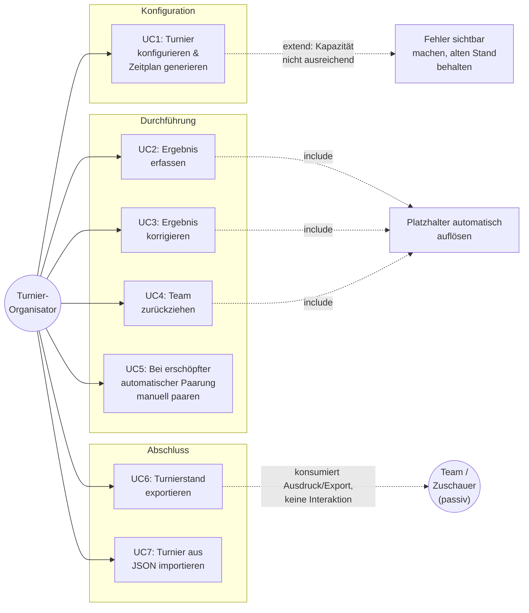

# Use-Cases und Geschäftsprozesse: Übersicht und Kritikalität

Dieses Dokument ist eine **lebende** Übersicht der Geschäftsprozesse (Use-Cases) des Turnier-Managers,
dokumentiert nach der **Use-Case-2.0-Methode** (Ivar Jacobson): jeder Use Case wird über ein
Kern-Slice (Happy Path) und erweiternde Slices (Alternativ-/Fehlerpfade) beschrieben, jeweils mit
eigenem Akzeptanzkriterium, ergänzt um eine ausformulierte Narrative. Ziel: verhindern, dass
Änderungen an einem Teil der App unbemerkt einen anderen, aus Organisator-Sicht wichtigen Ablauf
brechen — genau das ist am 2026-09-13 dreimal in Folge passiert (siehe „Bekannte Vorfälle" unten).

**Pflegeregel:** Bei jeder `superpowers:brainstorming`-Session wird dieses Dokument geprüft und bei
Bedarf ergänzt/korrigiert — neue Use-Cases/Slices, geänderte Kritikalität, neue/entfernte
Testabsicherung. Diese Regel ist in `AGENTS.md` verankert.

## Akteure und Use-Case-Übersicht

Die App hat einen aktiv interagierenden Akteur, den **Turnier-Organisator** (siehe arc42
Kapitel 3), sowie einen zweiten, aktuell rein **passiven** Akteur: **Team/Zuschauer**, der nur
Ausdrucke oder exportierte Webseiten konsumiert, ohne selbst mit dem System zu interagieren
(gestrichelte Kante im Diagramm).

**Vision 1 (noch nicht spezifiziert, siehe arc42 Kapitel 11.11):** Team/Zuschauer soll langfristig
ein aktiverer Akteur werden — z. B. mehrere Monitore in der Halle, die live unterschiedliche
Ansichten zeigen (ein Bildschirm die Gruppentabellen, ein anderer den Gesamtzeitplan). Das würde
einen weiteren Use Case "Live-Ansicht auf einem Zweitgerät anzeigen" einführen und hätte
Rückwirkungen auf ADR-01 (kein Server-Backend, siehe arc42 Kapitel 9) und die
`localStorage`-Beschränkung (siehe arc42 Kapitel 3, 11.9) — ohne irgendeine Form von
Synchronisation zwischen Geräten kann ein zweites Gerät den Live-Zeitplan nicht anzeigen.

**Vision 2 (noch nicht spezifiziert, siehe arc42 Kapitel 11.12):** Ein drittes, komplett neues
Akteur-Konzept — das **Kampfgericht** (Schiedsgericht am Spielfeld) soll Spielergebnisse künftig
direkt an den Turnier-Manager übermitteln können, statt dass der Organisator sie manuell nacherfasst
(UC2). Anders als Team/Zuschauer wäre das Kampfgericht ein AKTIV interagierender Akteur mit
eigenem, eingeschränktem Schreibzugriff (nur Ergebniseingabe für „sein" Spiel, keine
Konfigurationsrechte) — das würde die aktuelle Grundannahme "genau ein aktiver Nutzer pro
Gerät/Browser" (siehe arc42 Kapitel 1.4, 3) grundlegend infrage stellen.

Beide Visionen sind explizit nur als bekannte künftige Vorhaben festgehalten, damit sie bei einer
künftigen Brainstorming-Session nicht neu "entdeckt" werden müssen — kein Design, kein Plan, keine
Priorisierung zwischen ihnen vorgenommen.

Die vollständigen Slices und die Narrative jedes Use Cases stehen unten. Die folgende Tabelle
bleibt als schnelles Nachschlage-Cockpit über alle Use Cases hinweg erhalten.

## Kritikalitäts-Skala

| Stufe | Bedeutung | Testanforderung |
| --- | --- | --- |
| 🔴 **Kritisch** | Bricht dieser Prozess, ist die App für ein laufendes oder bevorstehendes reales Turnier unbrauchbar. Muss vor jedem Merge auf `main` funktionieren. | Muss durch mindestens einen E2E-Test (Playwright, echter Browser) abgedeckt sein, der den vollständigen Organizer-Flow nachspielt — nicht nur die zugrundeliegende Funktion isoliert. |
| 🟡 **Wichtig** | Bricht dieser Prozess, ist die App noch nutzbar, aber der Organisator stößt auf eine echte, störende Lücke (Fehlermeldung fehlt, Feature unbedienbar, aber es gibt einen Workaround oder es betrifft nur einen Teilmodus). | Sollte E2E-getestet sein; Unit-Tests der zugrundeliegenden Logik sind das Minimum. |
| ⚪ **Nice-to-have** | Komfortfunktion, deren Ausfall niemanden am Durchführen eines Turniers hindert. | Unit-Tests genügen. |

## Cockpit: alle Use Cases auf einen Blick

| # | Use Case | Kritikalität | Testabsicherung | Status |
| --- | --- | --- | --- | --- |
| UC1 | Turnier konfigurieren & Zeitplan generieren | 🔴 | siehe Slices unten | ✅ |
| UC2 | Ergebnis erfassen (inkl. automatischer Platzhalter-Auflösung) | 🔴 | siehe Slices unten | ✅ |
| UC3 | Ergebnis korrigieren | 🔴 | siehe Slices unten | ✅ |
| UC4 | Team zurückziehen | 🔴 (Swiss) / 🟡 (Nicht-Swiss) | siehe Slices unten | 🟡 teilweise, siehe Risiko R1 |
| UC5 | Bei erschöpfter automatischer Paarung manuell paaren (Swiss) | 🟡 | siehe Slices unten | ✅ |
| UC6 | Turnierstand exportieren (PDF/HTML/JSON) | 🔴 (JSON) / ⚪ (PDF/HTML) | siehe Slices unten | 🟡 teilweise |
| UC7 | Turnier aus JSON importieren | 🟡 | siehe Slices unten | 🟡 teilweise |
| N1 | Team-Logos in Spielplan/Ergebnissen | ⚪ | Unit-Tests für Alt-Text-Behandlung | ✅ |
| N2 | Eingebautes Anleitungs-Handbuch (`/anleitung`) | ⚪ | Kein Test (statischer Inhalt) | — |
| N3 | Barrierefreiheit der zentralen Seiten (WCAG 2.1 AA) | 🟡 (querschnittlich, kein eigener Use Case) | `e2e/accessibility.spec.ts` | ✅ (8 kuratierte Seiten) |

---

## UC1: Turnier konfigurieren & Zeitplan generieren

**Ziel:** Der Organisator legt Teams, Turniermodus und Rahmenbedingungen fest und erhält einen
vollständigen, widerspruchsfreien Zeitplan.

**Vorbedingung:** Mindestens 2 Teams sind erfasst.

**Akteur:** Turnier-Organisator.

### Kern-Slice: Happy Path

1. Organisator erfasst Teams (Name, optional Kürzel/Logo/Farbe/Kontakt).
2. Organisator wählt einen Turniermodus: Jeder-gegen-Jeden, Gruppenphase + Endrunde, oder
   Schweizer System.
3. *(Nur bei Gruppenphase + Endrunde mit mehr als einer Gruppe)* Organisator wählt zwingend eine
   Endrunden-Variante (Endrunde 1/3/4) — ohne diese Wahl bleibt der Generieren-Button deaktiviert
   (siehe Slice „Fehlende Endrunden-Variante" unten).
4. Organisator konfiguriert Feldanzahl, Hallenzeiten, Sperrzeiten, Spieleinstellungen.
5. Organisator klickt „Zeitplan generieren".
6. System erzeugt einen vollständigen Zeitplan: alle Paarungen, jedes Spiel auf einem konkreten
   Feld zu einer konkreten Uhrzeit, keine Doppelbelegung von Feld oder Team, keine Sperrzeit
   verletzt.

**Akzeptanzkriterium (Kern-Slice):** Nach Schritt 6 existiert ein `Schedule` mit mindestens einem
Spiel; kein Spiel liegt außerhalb der Hallenöffnungszeit oder innerhalb einer Sperrzeit; alle
konfigurierten Felder werden genutzt (kein Feld bleibt ungenutzt, während andere überlastet sind).

**Testabsicherung:** `e2e/all-tournament-variants.spec.ts` (alle 6 Varianten),
`e2e/multi-group-round-robin*.spec.ts`, `e2e/endrunde-1.spec.ts`, `e2e/endrunde-3.spec.ts`,
Generator-Unit-Tests (`schedule-generator.test.ts`, `playoff-generator.test.ts`,
`finals-variant-generator.test.ts`, `swiss-schedule.test.ts`).

### Erweiternder Slice: Fehlende Endrunden-Variante bei mehreren Gruppen

**Auslöser:** Modus „Gruppenphase + Endrunde" mit `groupCount > 1`, aber keine Endrunden-Variante
gewählt.

**Ablauf:** System deaktiviert den „Zeitplan generieren"-Button und zeigt einen erklärenden
Hinweis, bis eine Variante gewählt ist.

**Akzeptanzkriterium:** Ohne gewählte Variante ist kein Zeitplan generierbar — es kann strukturell
nie zu einem Zeitplan mit unauflösbaren Endrunden-Platzhaltern kommen.

**Testabsicherung:** `e2e/config-validation.spec.ts` ("organizer cannot generate a schedule for
multiple groups without choosing a finals variant"), `ConfigPage.test.tsx`.

**Bezug zu Vorfall V2** (siehe unten): Diese Regel wurde erst nachträglich eingeführt, nachdem
genau dieser Fall unbemerkt zu nie auflösbaren Platzhaltern führte.

### Erweiternder Slice: Feldanzahl über UI-Voreinstellung hinaus

**Auslöser:** Organisator braucht mehr als die im Dropdown initial sichtbaren Feldoptionen.

**Ablauf:** Das „Anzahl Felder"-Dropdown bietet 1 bis 6 Felder an (realistische Obergrenze für
eine einzelne Halle).

**Akzeptanzkriterium:** Jede gewählte Feldanzahl zwischen 1 und 6 wird vom Generator korrekt und
vollständig genutzt — keine künstliche Deckelung, die eine bereits konfigurierte Feldanzahl beim
erneuten Öffnen des Dropdowns wieder verringert.

**Testabsicherung:** `e2e/config-validation.spec.ts` ("the field-count dropdown offers up to 6
fields"), `TournamentForm.test.tsx`.

**Bezug zu Vorfall V1** (siehe unten).

### Erweiternder Slice: Kapazität nicht ausreichend (Fehlerfall)

**Auslöser:** Die konfigurierte Hallenzeit reicht nicht für die gewählten Spiele/Sperrzeiten aus
(gilt für Erstgenerierung UND für eine Neugenerierung eines bereits laufenden Turniers).

**Ablauf:** `generateSchedule` wirft eine Exception statt eines leeren/unvollständigen Ergebnisses.
Der Store fängt diese ab, setzt `scheduleGenerationError`, und lässt einen ggf. bereits
bestehenden Zeitplan UNVERÄNDERT. Die UI zeigt eine explizite Fehlermeldung.

**Akzeptanzkriterium:** Der Organisator sieht immer entweder einen erfolgreich generierten
Zeitplan oder eine explizite Fehlermeldung — nie einen stillschweigend veralteten oder
unvollständigen Zeitplan, den er für aktuell/korrekt halten könnte.

**Testabsicherung:** `e2e/config-validation.spec.ts` ("a failed schedule regeneration shows an
explanatory alert..."), `tournament-store.test.ts` (`generateAndSaveSchedule error handling`).

**Bezug zu Vorfall V3** (siehe unten).

---

## UC2: Ergebnis erfassen

**Ziel:** Der Organisator trägt das Ergebnis eines Spiels ein; bei mehrstufigen Formaten werden
automatisch die richtigen Teams in Folgespiele eingesetzt, sobald ihre Quelle feststeht.

**Vorbedingung:** Ein Zeitplan existiert; das betreffende Spiel hat bereits reale Team-IDs (kein
noch unaufgelöster Platzhalter).

**Akteur:** Turnier-Organisator.

### Kern-Slice: Happy Path (einfaches Spiel, kein Folgespiel betroffen)

1. Organisator öffnet die Ergebniserfassung des jeweiligen Modus (Swiss-, Gruppen-, Finals-,
   Playoff- oder Bracket-Ergebnisseite, je nach Turnierstruktur).
2. Organisator trägt Punktestände ein und speichert.
3. System schreibt `periodScores` auf das Spiel.

**Akzeptanzkriterium:** Das Spiel zeigt danach das eingetragene Ergebnis; die zugehörige
Tabelle/Rangliste berücksichtigt es sofort.

**Testabsicherung:** `e2e/swiss-tournament.spec.ts`, `e2e/all-tournament-variants.spec.ts`
(Tabellen-Assertions je Variante).

### Erweiternder Slice: Automatische Platzhalter-Auflösung (`include`)

**Auslöser:** Das eingetragene Ergebnis ist das letzte fehlende einer Gruppe, ODER es ist selbst
ein Vorgängerspiel eines K.-o.-Baums.

**Ablauf:** Nach dem Schreiben des Ergebnisses läuft `resolvePlaceholders` über ALLE Spiele:

- Ist eine referenzierte Gruppe jetzt vollständig ausgewertet, wird ihr Rang-N-Team in jedes
  Spiel eingesetzt, das diesen Rang als Quelle referenziert.
- Hat ein referenziertes Vorgängerspiel (K.-o.-Baum) jetzt selbst ein Ergebnis, wird
  Sieger/Verlierer in das Folgespiel eingesetzt.
- Zurückgezogene Teams werden dabei aus den Gruppenrängen herausgefiltert.

**Akzeptanzkriterium:** Jedes Folgespiel, dessen Quelle vollständig feststeht, zeigt sofort die
richtigen Teamnamen statt eines Platzhaltertexts — ohne manuelles Zutun des Organisators.

**Testabsicherung:** `e2e/endrunde-1.spec.ts`, `e2e/endrunde-3.spec.ts`,
`tournament-store.test.ts` (`resolvePlaceholders`-Testblock).

### Erweiternder Slice: Rundenfreigabe (Swiss)

**Auslöser:** Alle Spiele der aktuellen Swiss-Runde sind ausgewertet.

**Ablauf:** Die nächste Runde wird erst dann real generiert (`advanceSwissRound`) — vorher
existieren nur leere Platzhalter-Slots.

**Akzeptanzkriterium:** Solange auch nur ein Spiel der aktuellen Runde offen ist, kann die nächste
Runde nicht gestartet werden.

**Testabsicherung:** `e2e/swiss-tournament.spec.ts`.

---

## UC3: Ergebnis korrigieren

**Ziel:** Der Organisator korrigiert ein bereits eingetragenes Ergebnis, ohne den weiteren
Turnierverlauf unkontrolliert zu verändern.

**Vorbedingung:** Ein Spiel hat bereits ein Ergebnis.

**Akteur:** Turnier-Organisator.

### Kern-Slice: Happy Path (Folgestufe noch offen)

1. Organisator öffnet die Korrekturfunktion für ein bereits gewertetes Spiel.
2. Organisator trägt den korrigierten Punktestand ein.
3. System schreibt die Korrektur und löst `resolvePlaceholders` erneut aus (`include`, siehe UC2).
4. Eine Folgestufe, die noch KEIN eigenes Ergebnis hat, wird mit dem ggf. geänderten Team neu
   befüllt.

**Akzeptanzkriterium:** Ändert sich durch die Korrektur der Sieger/die Rangfolge, spiegelt sich
das in jeder noch offenen Folgestufe wider.

**Testabsicherung:** `e2e/endrunde-3.spec.ts` ("correcting a semifinal result re-resolves the
final with the new winner"), `e2e/swiss-tournament.spec.ts` (Korrektur-Test).

### Erweiternder Slice: Folgestufe bereits gespielt (Grenzfall)

**Auslöser:** Die Folgestufe, die von der korrigierten Vorstufe abhängt, hat selbst bereits ein
Ergebnis.

**Ablauf:** `resolvePlaceholders` überschreibt ein bereits gespieltes Folgespiel NIE rückwirkend.

**Akzeptanzkriterium:** Eine Korrektur der Vorstufe verändert ein bereits gespieltes Folgespiel
nicht — auch wenn dessen ursprüngliche Team-Zuordnung durch die Korrektur eigentlich falsch
geworden wäre. Dies ist eine bewusste Grenze (kein automatisches "Aufrollen" bereits gespielter
Folgespiele), kein Bug.

**Testabsicherung:** Implizit durch `resolvePlaceholders`-Unit-Tests (Guard
`g.periodScores.length > 0`).

---

## UC4: Team zurückziehen

**Ziel:** Ein Team wird während des laufenden Turniers zurückgezogen, ohne den Zeitplan von Hand
reparieren zu müssen.

**Vorbedingung:** Turnier läuft, das zurückzuziehende Team ist noch nicht bereits zurückgezogen.

**Akteur:** Turnier-Organisator.

### Kern-Slice: Happy Path (Schweizer System)

1. Organisator zieht ein Team im laufenden Schweizer-System-Turnier zurück.
2. System annulliert das laufende Spiel des Teams als Walkover, formt ALLE künftigen Runden neu
   (`reshapeFutureSwissRounds`, da diese erst zur Laufzeit generiert werden).

**Akzeptanzkriterium:** Das Turnier bleibt ohne manuelles Eingreifen fortsetzbar; künftige Runden
berücksichtigen die reduzierte Teamzahl korrekt (inkl. ggf. neuem Freilos-Bedarf).

**Testabsicherung:** `e2e/swiss-operational-safety.spec.ts` ("withdrawing a team mid-tournament
does not permanently block round progress").

### Erweiternder Slice: Rückzug in Gruppenphase/Platzierungsgruppe (Nicht-Swiss)

**Auslöser:** Rückzug während `stage === 'group'` oder `stage === 'placement'` (Endrunde 4).

**Ablauf:** `withdrawNonSwissTeam` annulliert verbleibende Spiele als Walkover, löst danach
`resolvePlaceholders` erneut aus (eine Annullierung kann eine Gruppe gerade eben vollständig
machen).

**Akzeptanzkriterium:** Wie Kern-Slice, aber ohne Neuplanung künftiger Runden (der gesamte
Zeitplan steht bei diesen Modi bereits fest, nur Annullierung ist nötig).

**Testabsicherung:** `tournament-store.test.ts` (Store-Ebene). **Kein E2E-Test bekannt.**

### Erweiternder Slice: Rückzug während eines laufenden K.-o.-Baums — NICHT ABGEDECKT

**Auslöser:** Rückzug während einer K.-o.-Bracket-Stage (`quarterfinal`, `semifinal`, `final`,
`third-place`, `round-of-16`, `round-of-32`) bei Endrunde 1/3.

**Ablauf:** `withdrawNonSwissTeam` filtert explizit nur `stage === 'group' || stage ===
'placement'` — für K.-o.-Stages existiert kein Annullierungspfad.

**Akzeptanzkriterium:** **Nicht erfüllt.** Aktuell folgenlos, da keine UI (`BracketResultsPage`,
`PlayoffResultsPage`) einen Rückzug in dieser Phase überhaupt anbietet — das Risiko ist latent,
nicht akut. Siehe Risiko R1 unten.

**Testabsicherung:** Keine. Dies ist eine dokumentierte Lücke, kein getesteter Zustand.

---

## UC5: Bei erschöpfter automatischer Paarung manuell paaren (Swiss)

**Ziel:** Wenn der Backtracking-Paarungsalgorithmus keine gültige Paarung mehr findet (alle
möglichen Gegner wurden bereits gespielt), kann der Organisator manuell eingreifen.

**Vorbedingung:** Schweizer-System-Turnier, automatische Paarung schlägt fehl
(`PairingConflictError`).

**Akteur:** Turnier-Organisator.

### Kern-Slice: Happy Path

1. System erkennt, dass keine gültige automatische Paarung mehr existiert.
2. System bietet eine manuelle Paarungs-Eingabe an (`SwissResultsPage.tsx`).
3. Organisator paart die Teams manuell (inkl. optionalem Freilos).
4. System übernimmt die manuelle Paarung als nächste Runde.

**Akzeptanzkriterium:** Das Turnier kann trotz erschöpfter automatischer Paarungsmöglichkeiten
fortgesetzt werden, ohne dass der Organisator den Zeitplan von Hand außerhalb der App verwalten
muss.

**Testabsicherung:** `e2e/swiss-operational-safety.spec.ts` ("manual pairing dialog appears when
automatic pairing is exhausted").

### Erweiternder Slice: Ungerade Teamzahl nach Rückzug erzeugt neuen Freilos-Bedarf

**Auslöser:** Ein Rückzug (UC4) macht die Anzahl aktiver Teams ungerade.

**Ablauf:** Eine noch nicht gezogene künftige Runde wird umgeformt, um ein Freilos einzuplanen.

**Akzeptanzkriterium:** Der Organisator muss dies nicht manuell erkennen/eingreifen — das System
plant das Freilos automatisch in die nächste noch offene Runde ein.

**Testabsicherung:** `e2e/swiss-operational-safety.spec.ts` ("withdrawal that makes the active
team count odd reshapes a not-yet-drawn future round to include a bye").

---

## UC6: Turnierstand exportieren (PDF/HTML/JSON)

**Ziel:** Der Organisator sichert den Turnierstand oder stellt ihn Dritten zur Verfügung.

**Vorbedingung:** Ein Zeitplan existiert.

**Akteur:** Turnier-Organisator.

### Kern-Slice: JSON-Export als Datensicherung (🔴 kritisch)

1. Organisator klickt „JSON herunterladen" auf der Export-Seite.
2. System erzeugt eine vollständige JSON-Datei (Turnierkonfiguration + Zeitplan + Ergebnisse).

**Akzeptanzkriterium:** Die exportierte Datei enthält den vollständigen, aktuellen Turnierstand
und lässt sich verlustfrei wieder importieren (siehe UC7).

**Testabsicherung:** **Kein dedizierter E2E-Test für den Export-Klick selbst.** Indirekt über
`json-import.ts`-Unit-Tests (Rundtrip-Kompatibilität) und
`e2e/multi-group-round-robin-large.spec.ts` (Import-Seite desselben Formats) abgedeckt. **Lücke:**
der Export-Klick selbst ist nicht E2E-getestet — für einen 🔴-kritischen Use Case eigentlich
Pflicht (siehe Kritikalitäts-Skala).

### Erweiternder Slice: PDF-Export (⚪ nice-to-have)

**Ablauf:** Formatierter Ausdruck für Aushang in der Halle.

**Akzeptanzkriterium:** Nicht formal festgelegt (Komfortfunktion).

**Testabsicherung:** Kein E2E-Test bekannt.

### Erweiternder Slice: Web-Export/HTML (⚪ nice-to-have)

**Ablauf:** Statische, druckfertige HTML-Version (ZIP) des Turniers zum Weitergeben.

**Akzeptanzkriterium:** Nicht formal festgelegt (Komfortfunktion).

**Testabsicherung:** Kein E2E-Test bekannt.

---

## UC7: Turnier aus JSON importieren

**Ziel:** Der Organisator lädt einen zuvor exportierten (oder aus einem Demo-Datensatz stammenden)
Turnierstand wieder in die App.

**Vorbedingung:** Eine gültige JSON-Datei liegt vor.

**Akteur:** Turnier-Organisator.

### Kern-Slice: Happy Path

1. Organisator wählt „JSON importieren" und wählt eine Datei.
2. System validiert die Datei (`parseTournamentImport`) und übernimmt sie vollständig als neuen
   Turnierstand.

**Akzeptanzkriterium:** Nach dem Import zeigt die App exakt den in der Datei enthaltenen Stand —
auch bei großen Turnieren (verifiziert mit 64 Teams/16 Gruppen).

**Testabsicherung:** `e2e/multi-group-round-robin-large.spec.ts` ("imports a 64-team, 16-group
tournament and generates a correct schedule" — importiert direkt über die reale UI, nicht per
`localStorage`-Injektion), `json-import.ts` Unit-Tests.

### Erweiternder Slice: Ungültige/fremde JSON-Datei

**Auslöser:** Die Datei ist kein gültiges Turnier-JSON (falsches Format, fehlende Pflichtfelder).

**Ablauf:** `parseTournamentImport` liefert einen Fehler, der als `importError` in der UI
angezeigt wird, ohne den bestehenden Turnierstand zu verändern.

**Akzeptanzkriterium:** Ein fehlgeschlagener Import darf den aktuellen Turnierstand nicht
beschädigen oder teilweise überschreiben.

**Testabsicherung:** `json-import.ts` Unit-Tests. **Kein E2E-Test für den Fehlerfall bekannt.**

---

## Nice-to-have- und querschnittliche Use Cases (kompakt)

| # | Use Case | Kurzbeschreibung | Testabsicherung |
| --- | --- | --- | --- |
| N1 | Team-Logos in Spielplan/Ergebnissen | Rein visuelle Aufwertung, dekorativ (`alt=""`). | Unit-Tests für die Alt-Text-Behandlung |
| N2 | Eingebautes Anleitungs-Handbuch (`/anleitung`) | Statische Hilfeseite in der App. | Kein Test (rein statischer Inhalt) |
| N3 | Barrierefreiheit der zentralen Seiten (WCAG 2.1 AA) | Kein eigener Use Case, sondern eine querschnittliche Qualitätsanforderung an UC1-UC7 (siehe arc42 Kapitel 10, QS-4). | `e2e/accessibility.spec.ts`, 8 kuratierte Seiten-/Zustandskombinationen |

## Bekannte Vorfälle (Beispiele, warum diese Übersicht existiert)

Alle drei am 2026-09-13 gefunden und behoben — festgehalten, weil sie zeigen, welche Art von Lücke
diese Übersicht künftig verhindern soll:

- **V1**: UC1 war verletzt — das Feld-Auswahl-Dropdown im UI war hart auf 1-4 begrenzt, obwohl das
  Datenmodell beliebige Feldanzahlen erlaubt. Bei Turnieren mit vielen Gruppen aber wenigen Feldern
  wirkte das wie ein Gruppen/Feld-Zuordnungsfehler, war aber ein UI-Limit. → behoben, jetzt bis 6
  Felder wählbar, E2E-abgesichert (siehe UC1, Slice „Feldanzahl über UI-Voreinstellung hinaus").
- **V2**: UC1 war verletzt — „Gruppenphase + Endrunde" mit mehreren Gruppen ließ sich ohne gewählte
  Endrunden-Variante generieren, was zu strukturell nie auflösbaren Platzhaltern im Halbfinale
  führte. → behoben, Generierung ist jetzt gesperrt, bis eine Variante gewählt ist (siehe UC1,
  Slice „Fehlende Endrunden-Variante bei mehreren Gruppen").
- **V3**: UC1 war verletzt — scheiterte die Spielplan-Generierung (z. B. weil eine neu hinzugefügte
  Sperrzeit die Hallenzeit sprengt), wurde der Fehler nirgends abgefangen; der Store behielt
  stillschweigend den alten, jetzt veralteten Zeitplan. Der Organisator sah keine Fehlermeldung und
  hätte einen veralteten Plan für echt gehalten. → behoben, `scheduleGenerationError` wird jetzt
  sichtbar angezeigt (siehe UC1, Slice „Kapazität nicht ausreichend").

## Bekannte Risiken (siehe auch arc42 Kapitel 11)

- **R1**: `withdrawNonSwissTeam` deckt keine K.-o.-Bracket-Stages ab (siehe UC4, Slice „Rückzug
  während eines laufenden K.-o.-Baums"). Aktuell folgenlos, da keine UI einen Rückzug in dieser
  Phase anbietet — wird aber zu einem echten Risiko, sobald jemand eine solche UI ergänzt, ohne
  diese Lücke zu kennen.
- **R2**: `computeEndrunde1Standings` vergibt nur 4 Plätze je Rangstufe, unabhängig von der
  Bracket-Größe (bewusste Design-Entscheidung, siehe `docs/superpowers/specs/2026-09-12-endrunde-1-bracket-design.md`).
  Bei einem 8er- oder größeren Bracket bleiben Plätze in der Mitte der Rangstufe unbelegt — für einen
  Organisator, der das nicht weiß, wirkt das wie eine fehlende Funktion.
- **R3** (neu identifiziert bei der Use-Case-2.0-Umstrukturierung): UC6 (JSON-Export) ist als
  🔴-kritisch eingestuft (einziger Datensicherungsweg, siehe arc42 ADR-01), hat aber keinen
  dedizierten E2E-Test für den Export-Klick selbst — nur indirekte Abdeckung über den Import-Pfad.
  Das widerspricht der eigenen Kritikalitäts-Skala dieses Dokuments (🔴 verlangt E2E-Abdeckung des
  vollständigen Organizer-Flows) und sollte in einer künftigen Session nachgezogen werden.

## Verweise

- Vollständige Architekturdokumentation: `docs/architecture/arc42/` (arc42-Standard, 12 Kapitel)
- Design-Spezifikationen der einzelnen Features: `docs/superpowers/specs/`
- Implementierungspläne: `docs/superpowers/plans/`
